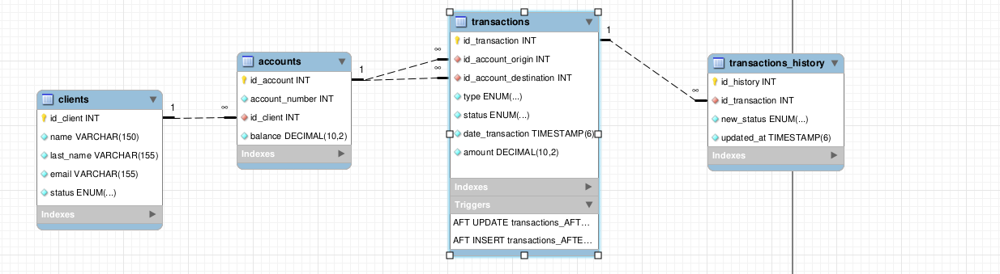

# Start

This document represents my thinking process and the steps I took to build the project. It will be updated as I progress through the project.

## 1. Project Overview

This project consists in a single page application that represents a bank page. The page will have a login form, a list of transactions and a balance. The transactions will be fetched from an API and the balance will be calculated based on the transactions.

Must contain:
1. A database ( Mysql )
2. An API ( API-Platform)
3. A backend ( Sympfony )
4. A frontend ( Angular )


## 2. Rules

Before starting the project I need to define some rules that will guide me through the project.

### 2.1 - Database
    
- Transactions:
    - Client
    - Origin Account
    - Destination Account
    - Type
        - Debit
        - Credit
    - Status
        - Open
        - Processing
        - Finalized

- Clients:
    - Accounts
        - Account 1
        &vellip;
        - Account N

- Transactions history:
    - Status

### 2.2 - API

Download [API Platform](https://github.com/api-platform/api-platform/releases/tag/v3.2.16) source code.

run the following commands:

```bash
docker compose build --no-cache
docker compose up -d
```

&vellip;

### 2.3 - Backend

1. Install [Docker](https://docs.docker.com/engine/install/ubuntu/)
2. Install Apache
```bash
sudo apt install apache2
```
3. Install [PHP](https://techvblogs.com/blog/install-php-8-2-ubuntu-22-04)
4. Install [nodejs and npm](https://www.digitalocean.com/community/tutorials/how-to-install-node-js-on-ubuntu-20-04)
5. Install [Composer](https://getcomposer.org/download/)
6. Install [Symfony](https://symfony.com/download)
7. Start a new project
```bash
symfony new symfony --version=6.* --webapp --docker 
```

### 2.4 - Frontend
```bash
sudo npm install -g @angular/cli@14.2.13
```

&vellip;

## 3. Database

Database design and creation.

Based on the rules defined in the previous section, I created this diagram:

